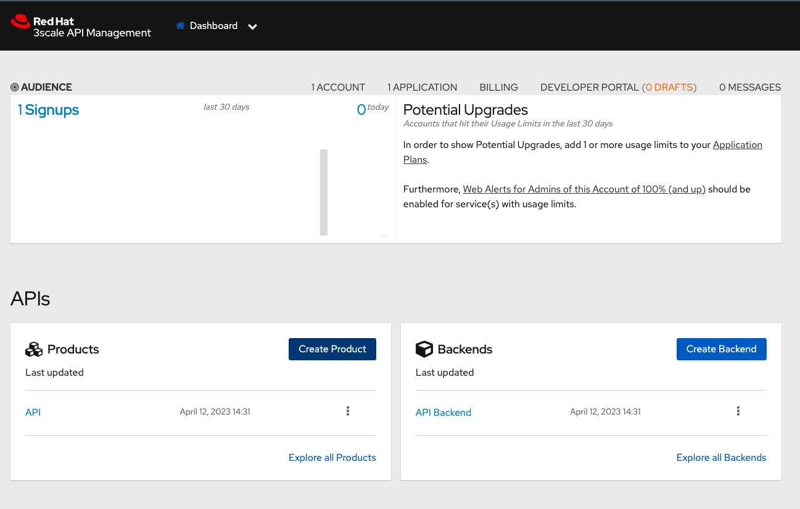
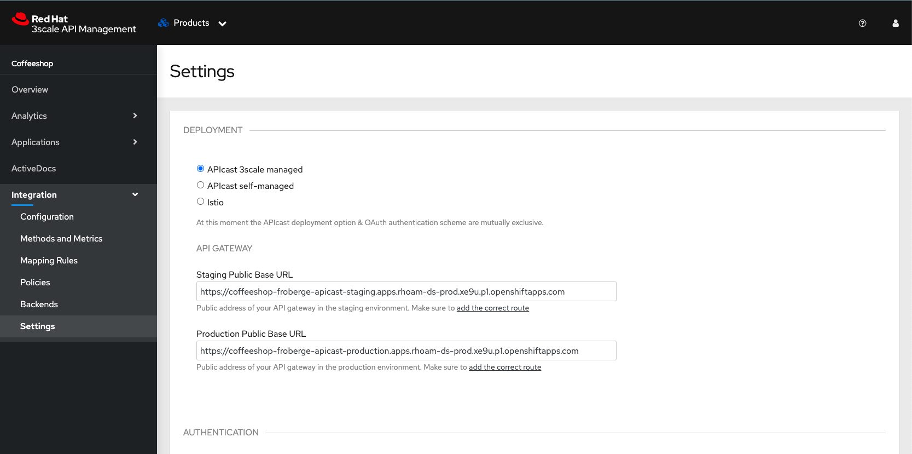
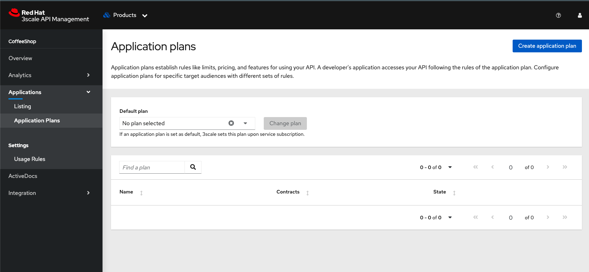
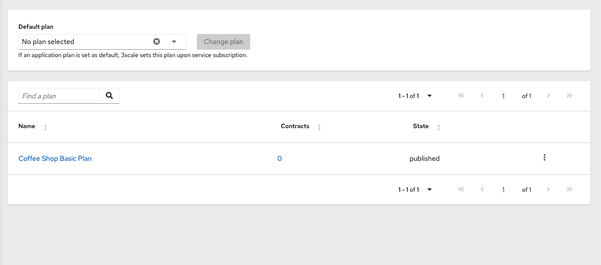
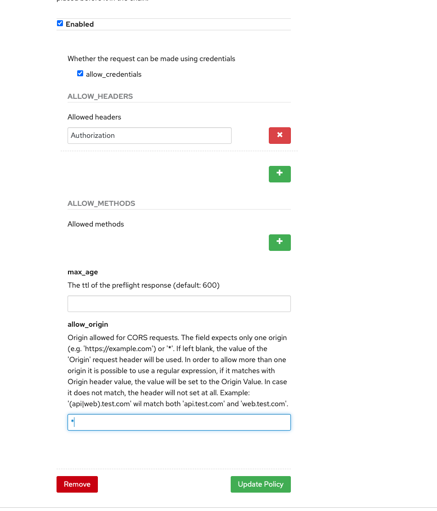
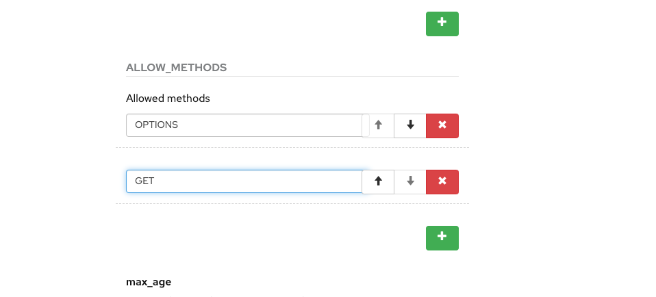

# OpenShift API Management Demo

This reposository contain a demo for Openshift Api Mangement 

## Goal

## More Link

  * [RHOAM Sandbox]((https://developers.redhat.com/developer-sandbox/activities/share-java--applications-openshift-api-management) )

----
## Requirement.

* Deploy `the product service` which reprensent your API backend for the coffee shop Product business line. The product Service was develop using Quarkus.
  * This service required a postgres database.
  * The schema creation script can be found [here](dbscripts/product-schema/createInsertProduct.sql)
  * The service uses a secret to connect to the database. Use [this template](manifest/postgresdb-secret-template.yaml)  to create your secret.
  * Requires the also the confimap found [here](manifest/productservice-cm.yaml)
* The Red Hat Integration 3scale operator install.
* The product service up and running on the OpenShift cluster
* [OPTIONAL] Postman to test the API calls.

----
## Demo

### Step 1: Define your API product

1. Connec to your 3scale Admin
    * In OpenShift in Networking select find the API Management URL. `zync-3scale-provider-*` by system-provider
    * Find the login credential under: `Wordload -> Secrets -> system-seed`
1. On the dashboard create a new Product Link
    
1. Use the following values
    * `Name:` Coffeeshop
    * `System Name:` coffeeshop
    * `Description:` The API for the coffee shop
1. Click `Create Product`
1. From the Overview Page, go to Integration->Setting to edit the API setting gateway
    
1. Leave everything as default for now and click update product.

### Step 2: Create the application Plans

Application plans establish rules like limits, pricing, and features for using your API. A developer's application accesses your API following the rules of the application plan. Configure application plans for specific target audiences with different sets of rules.

1. In `Apllication` select Application Plans.
1. `Create application Plan`
    
1. Enter values:
    * `Name:` Coffee Shop Basic Plan
    * `System name:` coffeeshop_basic_plan
1. Click `Ctrea Application Plan`
1. In the list click the 3 dots, and select `Publish` for the new created Plan
    

### Step 3: Define your audience

1. In the Main Menu select `Audience`
    ![audience](doc/images/audience.png
1. On the default Account, select the `link under apps`
1. On that page click `Create Application`
    * `Product:` CoffeeShop
    * `Application plan:` Coffee Shop Basic Plan
    * `Name:` dev_coffeeshop_app
    * `Description:` Developer CoffeeShop Basic App

### Step 4: Update Methods, Metrics & Mapping Rules

1. In the Main Menu select `Products`
1. Select `CoffeeShop`
1. Under Integration go to `Methods & Metrics`
1. Click `Add a method`
    * `Firendly name:` Get Coffees
    * `System name: ` coffees_all
    * Description: ` Method to return all the coffees
1. Click Create Method
1. Go to Mapping Rules
1. Click on the edit pencil
1. change the patern for `/product`
1. `Update Mapping Rule`

### Step 5: Define your API Policies

Red Hat 3scale API Management provides units of functionality that modify the behavior of the API Gateway without the need to implement code. These management components are know in 3scale as policies.

1. Under `Policies`, click `Add policy`
1. Click `CORS Request Handling` 
1. Rearrange the policies order
1. Edit the policies `CORS`
    
    
1. Update Policy Chain

### Step 6: Configure the Backends

1. Click on `Backend`
1. Click `Add backend`
1. Click `Create new backend`
    * `Name:` CoffeeShop Backend
    * `System Name:` coffeeshop_backend
    * `Description:` CoffeeShop API Backend
    * `Private Base URL:` http://product-service.coffeeshop.svc:8080
    :exclamation: We are using the internal API service, as we are deploying our services inside the same OpenShift cluster.
1. Click `Create BackEnd`
1. Click `Add to Product`

### Step 7: Publush the API

1. Click on `Configuration` 9 Notice the warning sign beside
1. Select Promote v.X to Staging APIcast
